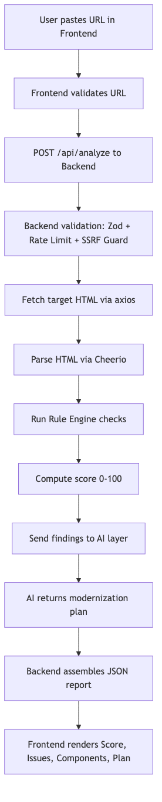
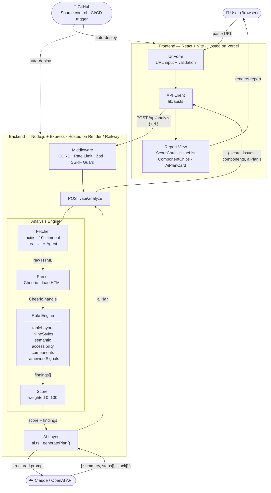
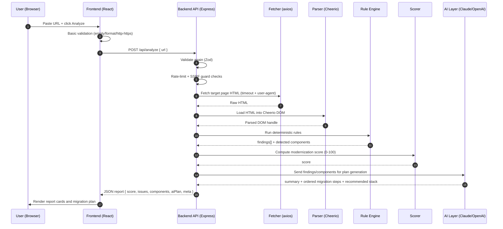

# LegacyLift — Architecture Workflow

## Quick Workflow (Plain English)

1. User pastes a URL in the frontend and clicks Analyze.
2. Frontend validates format and sends `POST /api/analyze` to backend.
3. Backend validates again, applies rate limit, and blocks unsafe URLs (SSRF guard).
4. Backend fetches the target page HTML using axios.
5. Backend parses HTML using Cheerio.
6. Rule engine runs deterministic checks (table layout, inline styles, semantic gaps, accessibility, components, framework signals).
7. Scorer computes a technical debt / modernization score (0-100).
8. AI layer receives findings and returns a structured modernization plan.
9. Backend sends one JSON report to frontend (`score`, `issues`, `components`, `aiPlan`, `meta`).
10. Frontend renders the final report sections for the user.

## Workflow Image

---

## Layer Summary

| Layer | Tech | Host |
|-------|------|------|
| Frontend | React 18 · TypeScript · Vite · Tailwind | Vercel |
| Backend | Node.js · Express · TypeScript | Render / Railway |
| Analysis Engine | Axios · Cheerio · Custom rule modules | (part of backend) |
| AI Layer | Claude API / OpenAI API | External |
| Source Control | GitHub | GitHub |

> **Core principle:** Rules find facts. AI explains and plans.

## Build Workflow (Implementation View)

