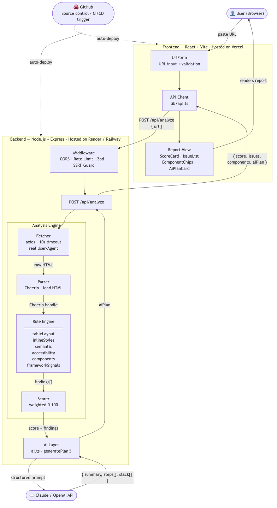

# LegacyLift

> **AI-powered legacy website analyzer that generates a step-by-step modernization blueprint.**

Paste any public URL → get a modernization score, grouped issue findings, detected components, and an AI-generated migration plan — all in under 15 seconds.

---

## Live Demo

🚀 **[legacylift.vercel.app](https://legacylift.vercel.app)** ← *(deploy URL — update after Phase 6)*


---

## What it does

| Step | What happens |
|------|-------------|
| 1 | You paste a public URL |
| 2 | Backend fetches the raw HTML (no headless browser) |
| 3 | Rule engine runs 10 deterministic checks |
| 4 | Scorer computes a 0–100 modernization score |
| 5 | AI generates a specific, ordered migration plan |
| 6 | Frontend renders the full report |

**Core principle:** *Rules find facts. AI explains and plans.*



---

## Tech Stack

### Frontend


### Backend


### AI


### Deployment


---

## Rule Engine (10 checks)

| Rule | Category | Severity |
|------|----------|----------|
| Table-based layout | Layout | Critical |
| Inline styles | Styling | Warning |
| Missing semantic tags | Semantics | Critical |
| Accessibility gaps (alt, labels, lang) | Accessibility | Critical |
| Legacy libraries (jQuery 1/2.x, Bootstrap 3/4) | Framework | Critical |
| Missing viewport meta / fixed-width | Mobile | Critical |
| Mixed content / unsafe `target="_blank"` | Security | Critical |
| Missing title, description, OG tags | SEO | Warning |
| Render-blocking scripts, no lazy-load | Performance | Warning |
| Deprecated HTML (`<font>`, `<center>`, `bgcolor`) | Deprecated HTML | Warning |

---

## Scoring Methodology

The score is a **deterministic, weighted deduction model** — not a heuristic or AI guess. Every point deducted is traceable to a specific rule finding in the HTML.

### Formula

```
score = max(0, round(100 − Σ deductions))

per_rule_deduction = min(
  base_severity_weight × category_multiplier × ceil(instance_count / 2),
  20   ← hard cap per rule, so one bad rule can't tank the entire score
)
```

### Step 1 — Severity base weight

Each finding starts with a base weight based on how severe the issue is:

| Severity | Base Weight | Meaning |
|----------|------------|---------|
| Critical | 15 pts | Breaks functionality, security risk, or major UX failure |
| Warning  | 7 pts  | Degrades quality, SEO, or performance noticeably |
| Info     | 2 pts  | Best-practice gap, low immediate impact |

### Step 2 — Category multiplier

Not all categories carry the same business risk. High-liability categories are weighted up:

| Category | Multiplier | Rationale |
|----------|-----------|-----------|
| Security | ×1.5 | Mixed content and tabnapping expose users directly |
| Framework | ×1.3 | EOL libraries (jQuery 1.x) have known CVEs, no patches |
| Mobile | ×1.3 | Google mobile-first indexing penalises non-responsive sites |
| SEO | ×1.0 | Affects visibility but doesn't break functionality |
| Performance | ×1.0 | Degrades UX, factored through instance count |
| Layout, Styling, Semantics, Accessibility, Deprecated HTML | ×1.0 | Standard weight |

### Step 3 — Instance scaling + per-rule cap

A rule that finds 1 instance is less severe than one that finds 20. The formula scales by `ceil(count / 2)` — every 2 instances counts as one additional unit of deduction. A **hard cap of 20 pts per rule** prevents a single prolific issue (e.g. 200 inline-styled elements) from zeroing the score unfairly.

### Worked example

> Site has: 3 mixed-content assets (security/critical), 1 missing viewport (mobile/critical), 12 inline styles (styling/warning)

| Rule | Base | Multiplier | Count factor | Raw | Capped |
|------|------|-----------|--------------|-----|--------|
| Mixed content | 15 | ×1.5 | ceil(3/2)=2 | 45 | **20** |
| No viewport | 15 | ×1.3 | ceil(1/2)=1 | 19.5 | **19.5** |
| Inline styles | 7 | ×1.0 | ceil(12/2)=6 | 42 | **20** |
| **Total deduction** | | | | | **59.5** |
| **Score** | | | | | **100 − 59.5 = 41 → "Needs Work"** |

### Score bands

| Score | Label | Meaning |
|-------|-------|---------|
| 70–100 | Modern | Minimal legacy debt, close to current standards |
| 40–69 | Needs Work | Notable issues that affect users or maintainability |
| 0–39 | High Risk | Significant technical debt, security or mobile liability |

---

## Running Locally

### Prerequisites
- Node.js 20+
- OpenAI API key ([platform.openai.com/api-keys](https://platform.openai.com/api-keys))

### Backend

```bash
cd backend
cp .env.example .env
# Add your OPENAI_API_KEY to .env
npm install
npm run dev
# Runs on http://localhost:3000
```

### Frontend

```bash
cd frontend
npm install
npm run dev
# Runs on http://localhost:5173
```

---

## Project Structure

```
legacylift/
├── frontend/
│   ├── src/
│   │   ├── components/     # UrlForm, ScoreCard, IssueList, ComponentChips, AiPlanCard
│   │   ├── lib/            # api.ts, types.ts
│   │   ├── styles/         # SCSS design system (_variables, _components, _responsive)
│   │   └── App.tsx
│   └── package.json
│
├── backend/
│   ├── src/
│   │   ├── engine/
│   │   │   ├── rules/      # 10 rule modules (pure functions)
│   │   │   ├── fetcher.ts  # axios HTML fetcher
│   │   │   ├── parser.ts   # Cheerio loader
│   │   │   ├── scorer.ts   # weighted scoring
│   │   │   └── ai.ts       # OpenAI integration + cache
│   │   ├── middleware/     # rate limiter, SSRF guard
│   │   └── routes/         # POST /api/analyze
│   └── package.json
│
├── PROJECT.md
└── README.md
```

---

## Security

- **SSRF protection** — blocks localhost, private IPs, non-http(s) schemes
- **Rate limiting** — 20 requests/hour per IP
- **Input validation** — Zod schema on every request
- **No stored data** — fully stateless, no database
- **API key** — never logged or exposed in responses

---

## Out of Scope (MVP)

- JavaScript-rendered SPAs (would require Playwright/headless browser)
- Multi-page crawling
- Authenticated/login-walled sites
- PDF/Markdown export
- Saved report history

---

## Author

**Divya Chandrapandi** — [github.com/divyachandrapandi](https://github.com/divyachandrapandi)
